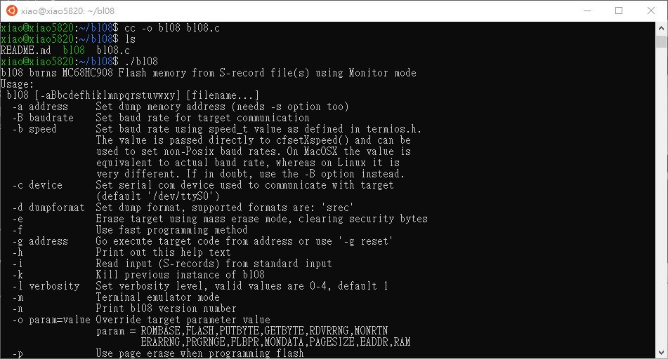

# bl08 loader fro MC68HC08 MCUs

project derived from http://www.sparetimelabs.com/bl08/bl08.php


forked,   
platform for build, https://github.com/xiaolaba/Openwrt_Ubuntu_20.04_setup   

build script,
```
apt list --upgradable  
sudo apt update  

## clone the source code
git clone https://github.com/xiaolaba/bl08  

## compile the source code
cd ~/bl08
cc -o bl08 bl08.c

## run the program
./bl08

```

Linux execuable, [bl08](bl08)  

done.



.  
.  
did not work....  

```

## do not work
gcc -Wall -std=c99 -pedantic -o bl08 bl08.c

## run the program
./bl08
```

  
  
```
##  cross-compiler to create a Windows executable in Linux
## Installing the cross-compilation
sudo apt-get install mingw-w64
sudo apt-get install gcc-9-locales wine wine64

## 32bit
cd ~/bl08
## do not work
i686-w64-mingw32-gcc -o bl08_32bit.exe bl08.c

## do not work
x86_64-w64-mingw32-gcc -o bl08_32bit.exe bl08.c --static

## 64bit
cd ~/bl08
## done not work
x86_64-w64-mingw32-gcc -o bl08_64bit.exe bl08.c

```
